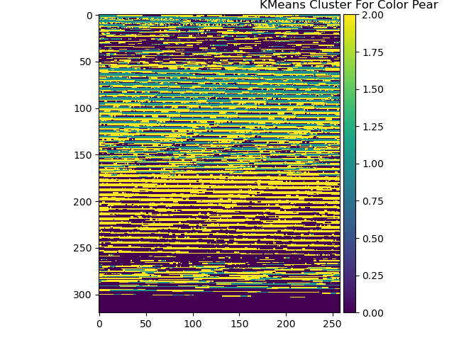
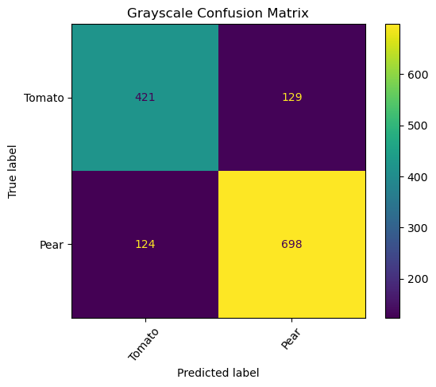
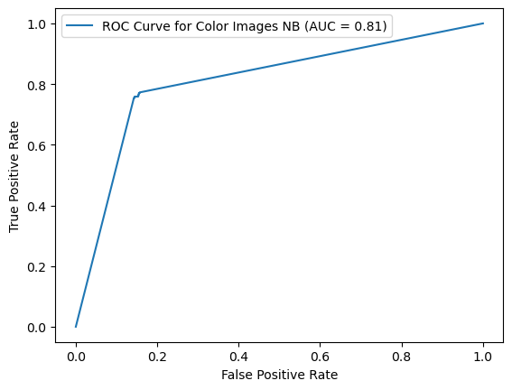
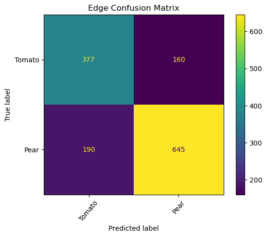
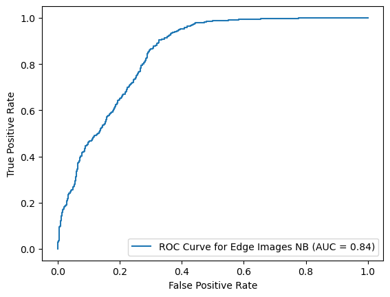
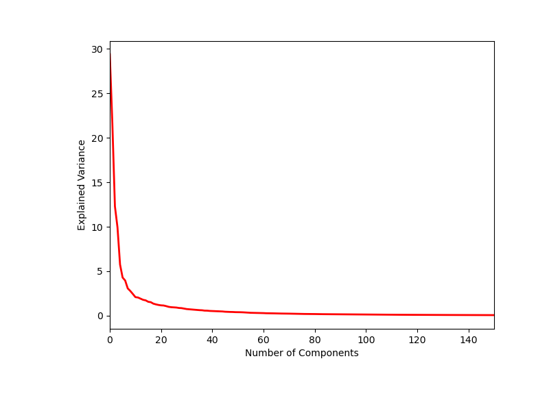
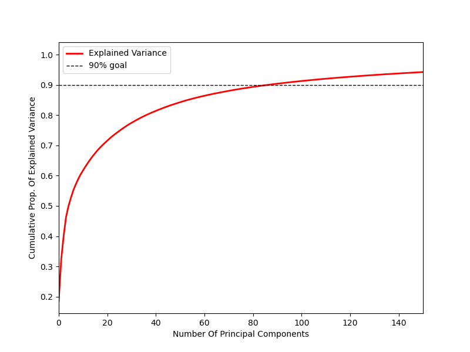
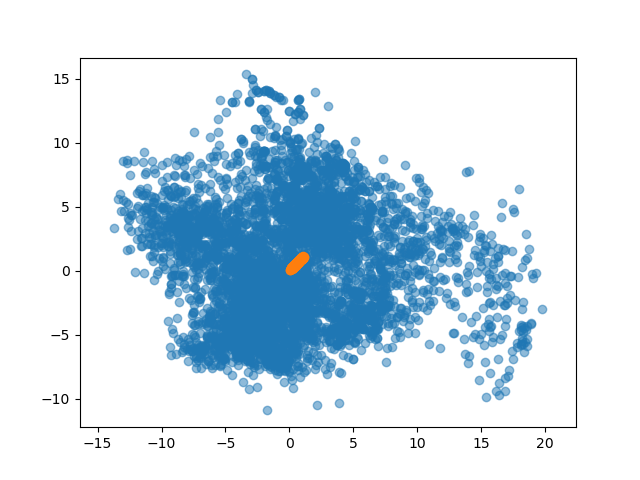

# Fruits, Veggies and Nutrition

# Table of Contents
1. [Background and Motivation](#BackGround-and-Motivation)
2. [Questions](#Questions)
3. [Data](#Data)
4. [Closer Look](#Closer-Look)
5. [Visualization](#Visualization)
6. [Conclusion](#Conclusion)
7. [Photo and Data Credits](#Photo-and-Data-Credits)
8. [Extras](#Extras)

# Background and Motivation

I have always been intrigued by how the cells in our bodies interact with each other, from
how we deal with stress to how what we put in our bodies. Several years ago, I came across
a book called ‘The Optimum Nutrition Bible’, but it wasn’t until last year that I was finally
able to start reading it. The book explains how a variety of stimulus to our bodies affects
our nutrition, which affects our health and wellness. It explains how food, drinks, sleep, stress, and
several other things affect our bodies in negative and positive ways.
This book is my main motivation for this capstone.

“Optimum nutrition is the medicine of the future.” - Linus Pauling, two-time Nobel Prize winner

# Data

I was able to find a couple data sets on kaggle named ‘Fruits 360’ and 'Fruit Recognition'.
The former data set is comprised of 90,483 100x100 ‘.jpgs’ of fruits and vegetables. 90,380 of those pictures are either a fruit or
vegetable and 103 have multiple fruits or vegetables. The 90,380 images were split into Training and Testing Folders. The data set has 131 folders for each class of fruits
and vegetables as different varieties of the same item were stored as belonging to different classes. There are 68 unique fruits and vegetables. 
The latter data set has 44,406 labelled fruit images. They are each 320×258 '.png'.
I, also, built my own data set of each item and some of its nutrition facts, which I placed into a ‘.csv’ and called as a data frame in pandas.
As part of my check of the data set I verified there were no broken nor fraudulent images.

# Goals

How successfully will a Naive Bayes model and a Convolution Neural Network train and test on a subset of all the images?
Learn Nutrition Facts from Pears and Tomatoes

Update to this 09/23/2020: Will be adding more ML models and Recommender, as well as deploying on AWS. I will expand on the database, as well.

# Closer Look

I spent quite a while deciding if I would use the whole data set with all unique items, but settled on a binary approach. I was left with deciding fruits and vegetables or which 2 unique fruits or vegetables. I ultimately decided on the latter.
I chose to combine the Training, Testing, and variety folders to their own unique folders, for simplicity. To start I've used a subset of Pears and Tomatoes from these two data sets. I settled on 2313 images of Tomatoes and 3175 images of Pears. With my goals in mind, I started by taking a look at the images and for visualization I got the average images. 

Average Pear/Average Tomato:

| Average Pear                       |                       Average Tomato |
|  --:                               |                                  --: |
|  |  |

To get an idea of what the pixels were doing I looked at the pixel intensities for grayscale and color.

Pear Grayscale Pixel Intensities/Pear Color Pixel Intensities:

| Pear Grayscale Pixel Intensities | Pear Color Pixel Intensities|
|  --:                                                 |                                              --: |
|  |  |

Tomato Grayscale Pixel Intensities/Tomato Color Pixel Intensities:

| Tomato Grayscale Pixel Intensities             |              Tomato Color Pixel Intensities|
|  --:                                                   |                                                --: |
|  |  |

KMeans was used to get an idea of how the pixels were clusterd based off of centroid of the pixels.

Pear Color KMean Cluster/Tomato Color KMean Cluster:

| Pear Color KMean Cluster               |                Tomato Color KMean Cluster|
|  --:                                           |                                              --: |
|  |  |

Edge Detection Pear/Tomato

| Pear Grayscale Edge             |                Tomato Grayscale Edge|
|  --:                            |                                 --: |
|  |    |

# Visualization

Once I got an idea of the pixels I began to model my images using greyscale, color, and the edges. I resized the images to 32x32. Using Multinomial Naive Bayes I plotted a Confusion Matrix, ROC Curve, and the Classification Report.

Accuracy is the ratio of correctly predicted observations to the total observations. This is used with a even data set, for example, False Positives and False Negatives are almost same.

Accuracy = TP+TN / TP+FP+FN+TN

Precision is the ratio of correctly predicted positive observations to the total predicted positive observations. High precision relates to a low false positive rate.

Precision = TP / TP+FP

Recall is the ratio of correctly predicted positive observations to all observations in the actual class.

Recall = TP / TP+FN. This is the True Positive Rate.

F1 Score is the weighted average of Precision and Recall. This is used with uneven class distribution.

F1 Score = 2*TP / 2*TP+FP+FN

Multinomial Naive Bayes:

Grayscale Confusion Matrix/Grayscale ROC Curve:

| Grayscale Confusion Matrix           |             Grayscale ROC Curve|
|  --:                                 |                            --: |
|  |  |

Classification Report For Grayscale Images:
 
| | Precision | Recall | F1_Score | Support |
|  --: |  --: | --: | --: | --: |
|  Pear| 0.84|  0.85| 0.85| 822|
|  Tomato| 0.77|  0.77| 0.77| 550|
| accuracy| | | 0.820| 1372|
| macro avg| 0.81|  0.81| 0.81| 1372|
| weighted avg| 0.82|  0.82 | 0.82 | 1372|

Color Confusion Matrix/Color ROC Curve:

| Color Confusion Matrix                 |                 Color ROC Curve|
|  --:                                   |                            --: |
|  |  |

Classification Report For Color Images:

| | Precision | Recall | F1_Score | Support |
|  --: |  --: | --: | --: | --: |
|  Pear| 0.83|  0.86| 0.84| 800|
| Tomato | 0.79|  0.75| 0.77| 572|
| accuracy| | | 0.81| 1372|
| macro avg| 0.81|  0.80 | 0.81| 1372|
| weighted avg| 0.81|  0.81| 0.81| 1372|

Edge Confusion Matrix/Edge ROC Curve:
| Edge Confusion Matrix                 |                 Edge ROC Curve|
|  --:                                  |                           --: |
|  |  |

Classification Report For Edge Images:

| | Precision | Recall | F1_Score | Support |
|  --: |  --: | --: | --: | --: |
|  Pear| 0.80|  0.77| 0.79| 835|
|  Tomato| 0.66|  0.70| 0.68| 537|
| accuracy| | | 0.74| 1372|
| macro avg| 0.73|  0.74| 0.73| 1372|
| weighted avg| 0.75|  0.74| 0.75| 1372|

Random Forest Classifier:

Classification Report For Grayscale Images:

|             | Precision |   Recall | F1_Score |  Support |
|         --: |    --:    |    --:   |    --:  |       --: |
|        Pear |      0.97 |     0.96  |    0.96   |    822 |
|      Tomato |      0.94 |     0.95  |    0.95   |    550 |        
|    accuracy |           |           |    0.96   |   1372 |
|   macro avg |      0.96 |     0.96  |    0.96   |   1372 |
|weighted avg |      0.96 |     0.96  |    0.96   |   1372 |

Classification Report For Color Images:

|             | Precision |   Recall | F1_Score |  Support |
|         --: |    --:    |    --:   |    --:  |       --: |
|        Pear |      0.98 |     0.99  |    0.98   |    800 |
|      Tomato |      0.98 |     0.97  |    0.98   |    572 |        
|    accuracy |           |           |    0.98   |   1372 |
|   macro avg |      0.98 |     0.98  |    0.98   |   1372 |
|weighted avg |      0.98 |     0.98  |    0.98   |   1372 |

Classification Report For Edge Images:

|             | Precision |   Recall | F1_Score |  Support |
|         --: |    --:    |    --:   |    --:  |       --: |
|        Pear |      0.90 |     0.94  |    0.92   |    835 |
|      Tomato |      0.90 |     0.84  |    0.87   |    537 |        
|    accuracy |           |           |    0.90   |   1372 |
|   macro avg |      0.90 |     0.89  |    0.89   |   1372 |
|weighted avg |      0.90 |     0.90  |    0.90   |   1372 |

I, then, ran a Convolution Neural Network on the color images as I was interested to see how that would train.
My first few attempts were around 50% and so I made some changes to get a scored of 94%.

# Conclusion

below needs to be updates

Using the Multinomial Naive Bayes:
The edge images performed best, scoring about 80%/81% for Tomato/Pear for F1. Color was second at 79%/80% for Pear/Tomato  for  F1. The grayscale was last scoring 77%/79% for Tomato/Pear for F1 score.

Using the Convolution Neural Network:
For grayscale, the CNN outperformed the Naive Bayes by almost 10%.

Update To "To My Chagrin" on 01/SEP/2020: Images have been cleaned to between 15 and 20 different rotations for nine different pears and tomatoes. This results in 163 pears and 145 tomatoes. I will continue to add/adjust images/variety/code/plots/readme as more images are acquired.

Update to "To My Chagrin" on 02/SEP/2020: Update to code to make more automatic. Updated plots and CNN statistics with updated cleaned images from 01/SEP/2020.

Update to "To My Chagrin" on 04/SEP/2020: Removed all but cleaned images from 02/SEP/2020 and downloaded three new data sets for Pear(3175) and Tomato(2298). Along with the cleaned images from the previous set, the new images have: multiple,
a back drop, and rotations. Will make updates to code and plots/images in the coming days.

To My Chagrin:

There are too many similar rotations in the data set and this was exacerbated by combining Training and Testing Folders. This can result in a high risk of training on the testing data and therefore better validation results, but poor overall results. 
As a future project I would like to spend more time cleaning up the fruits, vegetables, and their rotations, or returning to separated folders and running the models again.
I would also like to look at using AwS, as the data set was too large to run all images with original pixels on my local machine.
Something I would like to see come out of this project is an image recognition application that takes a picture of the item and returns its nutrition information.

# Data Credit

Horea Muresan, Mihai Oltean, Fruit recognition from images using deep learning, Acta Univ. Sapientiae, Informatica Vol. 10, Issue 1, pp. 26-42, 2018.
Here is the GitHub: https://github.com/Horea94/Fruit-Images-Dataset
Here is the Kaggle: https://www.kaggle.com/moltean/fruits

https://www.kaggle.com/chrisfilo/fruit-recognition

Information for the nutrition facts was compiled from Google searches.

# Extras

For some extra work I used Scree, Explained Variance, and PCA plots to perform Dimensionality Reduction. The ideal number of Principal Components was 86.

| Scree Plot                 |                  Variance Explained|
|  --:                       |                                --: |
|  |  |

| Information Discarded               |                           Data for 86 Components|
|  --:                                |                                             --: |
|  |  |

Below needs to be updated.
Below is a table of the 68 unique fruits and vegetables and some nutriion facts.

| Fruits Vegetables Name | Nutrition Facts |
| --: | --: |  
Apple |	Good for weight loss and your Heart. They're linked to a lower risk of Diabetes. They have Prebiotic effects and promote good Gut Bacteria, help prevent Cancer and contain compounds that can help fight Asthma.|
Apricot | Increases metabolism, which improves digestion preventing constipation and can help the body feel fuller, longer to aid in weight loss. Can help lower bad cholesterol levels.|
Avocado | Great source for Omega-3 Fatty Acids, antioxidants, Vitamin E, Vitamin K and Fiber. Eating avocados on a regular basis helps develop strong hair, nails, and healthy skin.|
Banana | Contain Manganese which is good for your skin. Potassium which is good for your heart health and blood pressure. They can aid digestion and help beat gastrointestinal issues. Bananas give you energy. They are good for digestion and help reduce the risk of cancer.|
Beetroot |	Associated with numerous health benefits, including improved blood flow, lower blood pressure, and increased exercise performance|
Blueberry |	Lower your risk of heart disease and cancer, they are also anti-inflammatory.|
Brazil Nut | Nutritional powerhouses, providing healthy fats, antioxidants, vitamins, and minerals. They're particularly high in selenium, a mineral with potent antioxidant properties. Eating Brazil Nuts reduce inflammation, support brain function, and improve your thyroid function and heart health.|
Cactus Fruit | Decrease blood sugar, reduce inflammation, and lower cholesterol.|
Cantaloupe | 100% of the daily value for vitamin C. A powerful antioxidant that protects your cells from damage. All your daily value of vitamin A, which helps keep your eyes, skin, bones, and immune system healthy.|
Carambula | Is anti-inflammatory and Heart-friendly. It Promotes weight loss, regulates blood pressure, boosts digestion and is diabetic-friendly. It improve metabolism, helps reduce cholesterol levels, and improve respiratory health.|
Cauliflower | High in fiber and B-vitamins. It provides antioxidants and phytonutrients that can protect against Cancer. It also contains fiber to enhance weight loss and digestion and Choline that is essential for learning and memory.|
Cherry | High in antioxidants, a great source of Beta Carotene, Vitamin C and Vitamin E.| 
Chestnut | Contain fat-soluble B vitamins that promote healthy skin, produce red blood cells and improve brain function. Contains high amounts of carbohydrates, which are needed for short and long term energy. They also help with nervous system function|
Clementine | Improves brain health and skin. Promotes strong bones, healthy muscles, oral health, and heart health. It has anti-cancer properties. Aids in digestion and electrolytes balance.|
Coconut | Provides good fats, enhances weight loss, keeps you hydrated improves skin health. Fights bacteria. Ensures healthy teeth and bones. Eliminates scalp infections.|
Corn | Contains valuable B vitamins, which are important to your overall health. Provides essential minerals such as zinc, magnesium, copper, iron and manganese. Corn is a good source of antioxidants and carotenoids, and lutein and zeaxanthin which promote eye health.|
Cucumber | It contains antioxidants. It promotes hydration. Aids in weight loss and lowering blood sugar. Promotes regularity in digestion.|
Dates | Help lower cholesterol. It is protein, vitamin and iron rich. Improves bone health, strengthens the nervous system, promotes digestion, and improves skin.|
Eggplant | Helps with digestion, improves heart health, aids in cancer and anemia prevention, improves bone health, and increases brain function.|
Fig | High in natural sugars, minerals and soluble fiber. Rich in minerals including Potassium, Calcium, Magnesium, Iron and Copper and are a good source of antioxidant Vitamins A and K that contribute to health and wellness.|
Ginger Root | Treats nausea, reduces muscle pain and soreness is an anti-inflammatory, improves heart disease risk factors, treats indigestion, reduces menstrual pain, lowers cholesterol. prevent Cancer. Improves brain function, protects against Alzheimer’s Disease and fights infections.|
Granadilla | Ideal for diabetics. Boosts immune system. Reduces anxiety, increases blood cell count improves gut health. It is a mild sedative. Lowers blood pressure and aids in muscle recovery. Regulates heart rate and blood pressure and reduces risk of cardivascular disease. Combats free radicals. Helps absorb iron|
Grape |	Grapes contain powerful antioxidants known as Polyphenols, improve heart health, blood pressure, reduces constipation, improves allergy symptoms, improves diabetes and eye health.|
Grapefruit | Benefit your immune system and promotes appetite control. It Has Been Shown to Aid in weight Loss. Grapefruit help prevent insulin resistance and diabetes. Eating Grapefruit improve heart health. It's high in powerful antioxidants and reduce the risk of kidney stones.|
Guave | help lower blood sugar levels. boost heart health. help relieve painful symptoms of menstruation. benefit Digestive System. aid in weight loss. have an anticancer effect. help boost your immunity. Eating Guavas is good for skin.|
Hazelnut | Hazelnuts are good for your heart, help reduce the risk of cancer, and aid in muscle, skin, bone, joint and digestive health.|
Huckleberry | Beneficial to the pancreas in digesting sugars and starches. High in Iron and help to build blood, help lower cholesterol, protects against Heart Disease, Glaucoma, Varicose Veins, Hemorrhoids, and Peptic Ulcers.|
Kaki | Loaded with nutrients. Excellent source of powerful antioxidants. Benefits Heart health. help reduce inflammation. Rich in Fiber. Supports Healthy Vision.|
Kiwi | Helps treat asthma. Aids digestion. Boosts immune system. Helps prevent sickness. Manages blood pressure. Reduces blood clotting. Protects against vision loss. Potential risks.|
Kohlrabi | Kohlrabi contains a wide array of antioxidants, such as Vitamin C, Anthocyanins, Isothiocyanates, and Glucosinolates. Diets high in antioxidant-rich vegetables like kohlrabi are associated with a reduced risk of diabetes, metabolic disease, and premature death|
Kumquats | They're high in Vitamins C and offer some Vitamin A. The skin is full of fiber and antioxidants (substances that can protect your cells). Kumquats are also cholesterol-free and low in fat and sodium.|
Lemon | It promotes hydration. It's a good source of vitamin C. It supports weight loss. It improves your skin quality. It aids digestion. It freshens breath. It helps prevent kidney stones.|
Limes | Rejuvenates skin. Several skin care products claim to promote healthier, younger looking skin. Improves digestion. Fights infections. Helps with weight loss. Lowers blood sugar. Reduces heart disease. Prevents cancer. Reduces inflammation.|
Lychee | Good for your Skin. Lychee can help fight signs of ageing and blemishes. Aid weight loss. Lychee is a great source of dietary fiber which plays an instrumental role in weight loss. Promotes stronger bones. Lychee is full of essential nutrients like Magnesium, Phosphorus, Iron, Manganese and Copper.|
Mandarine | Mandarins contain Vitamins A, B, and a high level of Vitamin C, powerful antioxidants that neutralizes free radicals, prevents infections, cramps, and vomiting, and is great for the health of your skin.|
Mango | It helps in fighting cancer. Helps in maintaining Cholesterol level. It helps in cleansing skin. Helps in regulating diabetes. Helps in alkalising your body. A way to lose weight. For healthy eyes. They also aid in digestion and provide Potassium.|
Mangostan | Good source of antioxidants and vitamins. Boosts immunity. Helpful for menstrual problems. Regulates blood pressure and boosts Heart health. Anti-inflammatory properties. Boosts skin care. Aides with digestion.|
Maracuja | Provides key nutrients. Rich in antioxidants. Good source of Fiber. Low Glycemic index. Improve insulin sensitivity. Boosts the immune system. Supports heart health. Reduce anxiety.|
Melon Piel De Sapo | It is very rich in Potassium which is good for your heart. Its main quality is the high concentration of Vitamins A and C: just 200 grams of melon, in fact, contain 60 mg of Vitamin C which is good to strengthen the immune system and protect the skin.|
Mulberry | Digestive health. Improves blood circulation. Boosts your immune system. Improves you vision. Treats dry and sensitive skin. Good for your hair. Anti-ageing properties. Maintains heart health.|
Nectarine |	Improved metabolism, digestion, and heart health.|
Onion | Benefit Heart Health. Loaded with Antioxidants. Helps control blood sugar. boost bone density. Have antibacterial properties. boost digestive health.|
Orange | Healthy immune system. Prevents skin damage. Keeps blood pressure in check. Lowers cholesterol. Controls blood sugar level. Lowers the risk of cancer.|
Papaya | Helps in improving eye health. Aids digestion. Anti-ageing. Boosts Immunity. Helps in weight loss. Better kidney health. Great for diabetics. Better cardiovascular health.|
Passion_Fruit | Passion fruit is highly rich in Vitamin C, Beta-Cryptoxanthin and Alpha-Carotene that boosts your immunity. It also has Iron which increases Haemoglobin in red blood cells. The rich content of Riboflavin (Vitamin B6) and Niacin (Vitamin B3) in passion fruit helps in regulating the thyroid activity in our body|
Peach | Peaches are full of Vitamin C, Vitamin A, Vitamin K, Vitamin B6, Potassium, Magnesium, Ccalcium and Iron.| 
Pear | promote gut health. Contain beneficial plant compounds. Have anti-inflammatory properties. offer anticancer effects. Linked to a lower risk of diabetes. boost heart health. help you lose weight.|
Pecan | Pecan nuts contain Monounsaturated Fats such as Oleic Acid along with Phenolic Antioxidants which help reduce the risk of Heart Disease. Improves Digestion. Helps with weight Loss. Reduces the Risk of Cancer. Anti-Inflammatory benefits. Boosts immunity. Prevents skin problems. Anti-aging benefits.|
Pepino | Reduces the risks of stress. Reduces the risk of hypertension. Helps in preventing diabetes. It lowers the blood cholesterol levels. It is essential in increasing stamina.|
Bell Pepper | Reduced risk of many chronic illnesses, such as Cancer and Heart Disease. Eye health. Anemia prevention.| 
Physalis | Used as a Diuretic. Protecting Liver and Kidney against Fibrosis. Healthy Pregnancy. Relief of Arthritis Pain. Improved cognitive ability. Cardiovascular functions. Improves Eyesight.|
Pineapple |	Contains disease-fighting antioxidants. Its enzymes can ease digestion. help reduce the risk of Cancer. boost immunity and suppress inflammation. ease symptoms of Arthritis. speed recovery after surgery or strenuous exercise|
Pitahaya Red | It's rich in antioxidants like Flavonoids, Phenolic Acid, and Betacyanin. It's naturally fat-free and high in Fiber. It help lower your blood sugar. It contains Prebiotics, which are foods that feed the healthy bacteria called Probiotics in your gut. Heart Healthy. Skin Care. |
Plum | Relieves constipation. Protect the body against cell and tissue damage. Helps lower blood sugar. Promotes bone health. Plums benefit Heart health. They aid in digestion. Reduce anxiety.|
Pomegranate | Protects us from free radicals. It thins your blood. Prevents Atherosclerosis. It acts like an oxygen mask. It prevents Arthritis. Fights Erectile Dysfunction. Fights Heart Disease and Prostate Cancer.|
Pomelo Sweetie | Promotes weight loss. Rich in antioxidants. Boosts heart health. Has anti-aging properties. Antibacterial and antifungal. Fights cancer cells|
Potato | Contains Antioxidants. Potatoes are rich in compounds like flavonoids, carotenoids and phenolic acids. Improve Blood Sugar Control. Improve Digestive Health.|
Quince | Anti-inflammatory, helps weight loss, treats ulcers. Treats stomach ailments, antioxidants. Treats nausea and vomiting. Antiviral. Lowers blood pressure. Lowers cholesterol. Relieves stress. Treats Liver and eye disease.|
Rambutan |	Decreases unwanted fat due to high fiber and water content and low calorie count. Source of iron. Skin and hair care. Rich in Vitamin C. Improves sperm quality. Anti-Cancer.|
Raspberry |	They protect against diabetes, cancer, obesity, arthritis and provide anti-aging effects.| 
Redcurrant | Helps to fortify the capillaries, protecting the body tissues and preventing Arteriosclerosis, Apoplexy and Diabetes.|
Salak |	Improves eye sight. Good for Stomach. Memory booster. Control of blood sugar level. Maintain cardivascular health. Maintain stamana. Cure nearsightedness. Good for pregancy. Helps in weight loss.|
Strawberry | Protect your heart, increase HDL (good) cholesterol, lower your blood pressure, and guard against Cancer.|
Tamarillo |	Responsible in helping reduce level of blood sugar, especially in people with type II Diabetes Mellitus. Has antioxidants which help to lessen the oxidative stress in the liver and pancreas.|
Tangelo | They are rich in dietary fiber, which aids in digestion and healthy bowels. They are also a good source of vitamin C, which aids in the growth and repair of tissues, and vitamin A, which helps boost the immune system.|
Tomato|	Tomatoes are a source of Vitamin C and Vitamin A. They are also high in Lycopene which helps fight heart disease and some Cancers.|
Walnut | Decrease inflammation. Promotes a healthy Gut. Reduce risk of Cancer. Supports weight control. Helps manage Type 2 Diabetes and lowers risk. Help lower blood pressure.|
Watermelon | Helps hydration, contains nutrients and beneficial plant compounds, contains compounds that help prevent Cancer, improves Heart health, lowers inflammation and oxidative stress, helps prevent Macular Degeneration, helps relieve muscle soreness.|
